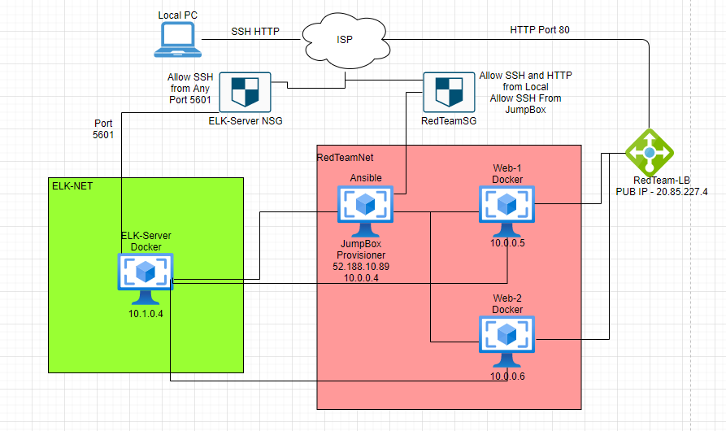
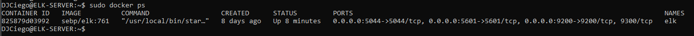

## Automated ELK Stack Deployment

The files in this repository were used to configure the network depicted below.

These files have been tested and used to generate a live ELK deployment on Azure. They can be used to either recreate the entire deployment pictured above. Alternatively, select portions of the yml file may be used to install only certain pieces of it, such as Filebeat.

  - _filebeat-playbook.yml_

This document contains the following details:
- Description of the Topologu
- Access Policies
- ELK Configuration
  - Beats in Use
  - Machines Being Monitored
- How to Use the Ansible Build

### Description of the Topology

The main purpose of this network is to expose a load-balanced and monitored instance of DVWA, the D*mn Vulnerable Web Application.

Load balancing ensures that the application will be highly available, in addition to restricting traffic to the network.

A Load Balancer efficiently distributes traffic from Clients across several several servers. Load Balancers sit between the Client and the Servers which can enhance Security, and Performance. 

What is the advantage of a Jumpbox?

A jump box is a secure computer that all admins first connect to before launching any administrative task or use as an origination point to connect to other servers or untrusted environments.

Integrating an ELK server allows users to easily monitor the vulnerable VMs for changes to the JumpBox and system network.
- _File Beat watches for Log Data.
- _Metric Beat Collets Metrics from the OS and running services on the Server.

The configuration details of each machine may be found below.
_Note: Use the [Markdown Table Generator](http://www.tablesgenerator.com/markdown_tables) to add/remove values from the table_.

| Name      | Function  | IP Address | Operating System |
|-----------|-----------|------------|------------------|
| Jump Box  | Gateway   | 10.0.0.4   | Linux            |
| Web-1     | WebServer | 10.0.0.5   | Linux            |
| Web-2     | WebServer | 10.0.0.6   | Linux            |
| ELK-Server| Monitoring| 10.1.0.4   | Linux            |

### Access Policies

The machines on the internal network are not exposed to the public Internet. 

Only the Jumpbox Provisioner machine can accept connections from the Internet. Access to this machine is only allowed from the following IP addresses:
- 5601 Kibana Port

Machines within the network can only be accessed by _____.
- My IP Address 71.178.223.50

A summary of the access policies in place can be found in the table below.

| Name     | Publicly Accessible | Allowed IP Addresses |
|----------|---------------------|----------------------|
| Jump Box | Yes                 | 71.178.223.50        |
|Web-1     | No                  | 10.1.0.4             |
|Web-2     | No                  | 10.1.0.4             |
|ELK-Server| No                  | 10.1.0.4             |

### Elk Configuration

Ansible was used to automate configuration of the ELK machine. No configuration was performed manually, which is advantageous because...
- Ansible is a Free Open Source Tool
- Able to Configure Highly Complex Workflows
- Allows for more room for more resources on Clients.

The playbook implements the following tasks:
- Install docker.io
- Install pip3
- Install Docker Python Module
- Increase Virtual Memory
- Download and Launch Docker

The following screenshot displays the result of running `docker ps` after successfully configuring the ELK instance.

### Target Machines & Beats
This ELK server is configured to monitor the following machines:
| Name     | IP Address |
|----------|------------|
|Web-1     | 10.0.0.5   |
|Web-2     | 10.0.0.6   |

We have installed the following Beats on these machines:
- Filebeat to collect data about the File System
- Metricbeat to collect machine metrics

These Beats allow us to collect the following information from each machine:
- _TODO: In 1-2 sentences, explain what kind of data each beat collects, and provide 1 example of what you expect to see. E.g., `Winlogbeat` collects Windows logs, which we use to track user logon events, etc._

### Using the Playbook
In order to use the playbook, you will need to have an Ansible control node already configured. Assuming you have such a control node provisioned: 

SSH into the control node and follow the steps below:
- Copy the _____ file to _____.
- Update the _____ file to include...
- Run the playbook, and navigate to ____ to check that the installation worked as expected.

_TODO: Answer the following questions to fill in the blanks:_
- _Which file is the playbook? Where do you copy it?_
- _Which file do you update to make Ansible run the playbook on a specific machine? How do I specify which machine to install the ELK server on versus which to install Filebeat on?_
- http://104.42.192.134:5601/

_As a **Bonus**, provide the specific commands the user will need to run to download the playbook, update the files, etc._
